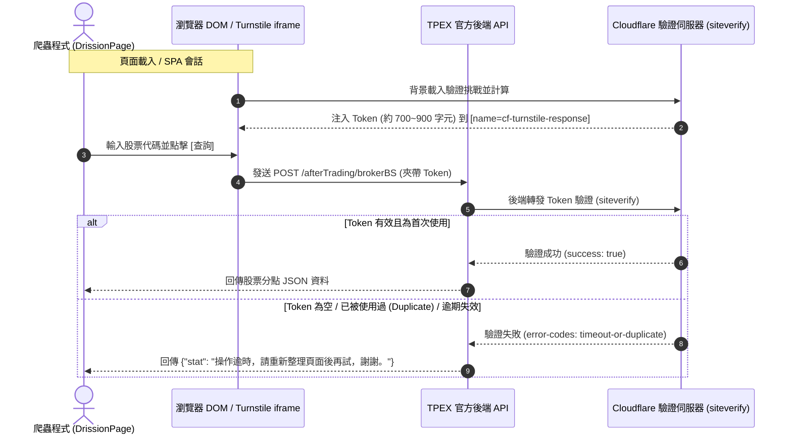
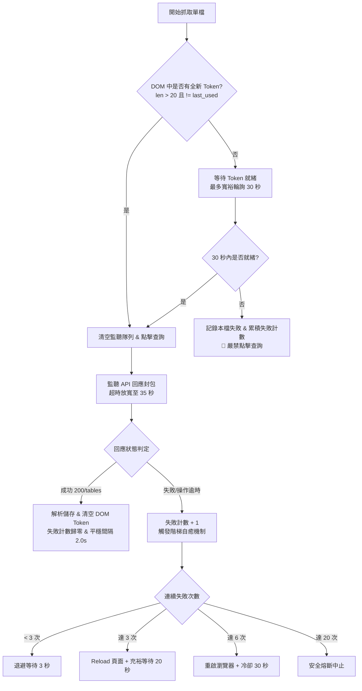

# 📊 TPEX 雲端爬蟲「操作逾時」根因分析與改造對策說明書

---

## 📌 一、 問題背景與現象描述

在 `stock_data_downloader` 專案中，當於 **GitHub Actions 雲端 Runner (Ubuntu + Xvfb)** 執行 TPEX（上櫃市場）分點買賣日報表爬蟲 (`tpex_crawler_cloud.py`) 時，經常在前數檔股票正常抓取後，突然全面爆發以下異常，並引發後續所有標的骨牌式連續失敗：

```text
[09:47:49]   [上櫃 9/51] [OK] 3441 (795 筆) | 速度: 0.43 檔/s | 剩餘約: 1.6 分鐘
...
[09:49:58]   [上櫃 6/16] [非預期回應: 操作逾時，請重新整理頁面後再試，謝謝。] 8088
[09:50:00]   [上櫃 7/16] [非預期回應: 操作逾時，請重新整理頁面後再試，謝謝。] 8234
[09:50:02]   [上櫃 8/16] [非預期回應: 操作逾時，請重新整理頁面後再試，謝謝。] 8410
[09:50:04]   [上櫃 9/16] [非預期回應: 操作逾時，請重新整理頁面後再試，謝謝。] 8489
[09:50:06]   [上櫃 10/16] [非預期回應: 操作逾時，請重新整理頁面後再試，謝謝。] 8941
[09:50:11]   [上櫃 11/16] [非預期回應: 操作逾時，請重新整理頁面後再試，謝謝。] 00724B
[09:50:13]   [上櫃 12/16] [非預期回應: 操作逾時，請重新整理頁面後再試，謝謝。] 00772B
[09:50:15]   [上櫃 13/16] [非預期回應: 操作逾時，請重新整理頁面後再試，謝謝。] 00840B
[09:50:17]   [上櫃 14/16] [非預期回應: 操作逾時，請重新整理頁面後再試，謝謝。] 00877
[09:50:18]   [上櫃 15/16] [非預期回應: 操作逾時，請重新整理頁面後再試，謝謝。] 00969B
[09:50:20]   [上櫃 16/16] [非預期回應: 操作逾時，請重新整理頁面後再試，謝謝。] 00987B
[*] [雲端重跑] 第 2 輪未完成 16 檔，冷卻 15 秒後啟動第 3 輪重跑補抓...
```

### 關鍵特徵觀察：
1. **初期抓取順暢**：第 1～9 檔（1259～3441）完全正常，耗時僅約 19 秒。
2. **崩潰速度極快**：從第 10 檔或重跑輪次開始，每檔失敗耗時僅 **1～2 秒**。
3. **連鎖死亡效應**：一旦第一檔出現該錯誤，後續標的 100% 崩潰，無法自我恢復。

---

## 🔍 二、 底層機制真相：什麼是「操作逾時」？

> [!IMPORTANT]
> **「操作逾時，請重新整理頁面後再試，謝謝。」並非網路 Socket Timeout 或網頁載入緩慢！**
> 這是 **TPEX 後端伺服器在向 Cloudflare 驗證 Turnstile Token 失敗時返回的標準錯誤代碼**。

TPEX 日報表查詢頁面採用 **Cloudflare Turnstile (Invisible 隱形模式)** 保護，完整通訊流程如下：



---

## 💥 三、 原程式四大致命缺陷剖析

經深入檢查 `tpex_crawler_cloud.py`，導致該錯誤的核心缺陷如下：

### 缺陷 1：引爆點 —「每 10 檔強制整頁刷新」＋「Token 等待超時過短」
* **原始程式碼**（第 360～368 行）：
  ```python
  if idx > 1 and (idx - 1) % 10 == 0:
      page.get(self.TPEX_URL, retry=2, timeout=20)
      for _ in range(40):
          time.sleep(0.08)  # 40 * 0.08 = 僅等待 3.2 秒！
          tok = page.run_js("return (document.querySelector('[name=cf-turnstile-response]') || {}).value || '';")
          if tok and len(tok) > 20 and tok != last_used_token:
              break
  ```
* **致命原因**：在 GitHub Actions（海外 Linux 雲端環境）中，整頁刷新後，Cloudflare Turnstile iframe 載入、執行環境特徵檢測到完成運算，通常需要 **5 ～ 12 秒**。程式僅等待 **3.2 秒** 便結束迴圈，此時 Token 根本尚未生成（為空字串）。

---

### 缺陷 2：門禁完全破防 —「未取得 Token 依然強制送出查詢」
* **原始程式碼**（第 390～425 行）：
  ```python
  token_ready = False
  for _ in range(25):
      time.sleep(0.08)
      current_token = page.run_js("...")
      if current_token and len(current_token) > 20:
          token_ready = True
          break

  if not token_ready:
      page.get(self.TPEX_URL, retry=2, timeout=20)
      # 再次只等待 2.8 秒...

  # ⚠️ 致命漏洞：不論 token_ready 是 True 還是 False，程式碼沒有 return 或 continue！
  page.listen.clear()
  page.run_js("btn.click();")  # 依然硬點查詢！
  ```
* **致命原因**：當等待逾時且 `token_ready == False` 時，程式完全沒有跳過該檔或進行防禦，而是直接呼叫 `btn.click()`，**把空 Token 暴力送給 TPEX 後端**，直接觸發後端拒絕。

---

### 缺陷 3：死循環連鎖崩潰（失敗即刷新，刷新又逾時）
* **原始程式碼**（第 477～487 行）：
  ```python
  else:
      failed_symbols.append(sym)
      print(f"[{ts_res}] [非預期回應: {stat_msg}] {sym}")
      last_used_token = current_token
      # 遭遇非預期回應，立刻整頁刷新！
      page.get(self.TPEX_URL, retry=2, timeout=20)
      for _ in range(35):
          time.sleep(0.08)  # 又只等待 2.8 秒！
  ```
* **骨牌崩潰連鎖鏈**：
  $$\text{第 10 檔拿空票} \xrightarrow{\text{報錯}} \text{強制刷新(等2.8s)} \xrightarrow{\text{依然無票}} \text{第 11 檔送空票} \xrightarrow{\text{報錯}} \text{強制刷新} \dots$$
  1. 導致後續所有標的全部在 2 秒內接連秒殺。
  2. 短時間內連續幾十次高頻刷新 Cloudflare 頁面，直接被 Cloudflare WAF 標記為惡意流量，降級為人工驗證框，導致整台虛擬機的瀏覽器會話永久失效。

---

### 缺陷 4：舊 Token 重複利用（Duplicate Token 漏洞）
* `last_used_token` 僅在報錯時被記錄（第 480 行），**在成功抓取時完全沒有更新**。
* 檢查條件只看 `len(current_token) > 20`，未比對 `current_token != last_used_token`。
* 前一檔抓取成功後，若 Turnstile 尚未換發新票，DOM 中仍殘留著已使用過的舊 Token，程式誤判為就緒並直接發送，被 Cloudflare 判定為 Duplicate 作廢。

---

## ⏱️ 四、 雲端 20 分片時間餘裕分析（Time Budget）

> [!TIP]
> **關鍵優勢：分片每節點僅需處理 50 筆，時間餘裕極度充裕！**

| 維度指標 | 數值與計算 | 說明 |
| :--- | :--- | :--- |
| **總標的數 / 分片數** | 1,007 檔 / 20 Shards | **每 Shard 僅需負責約 50 ～ 51 檔** |
| **GitHub Actions 限制** | `timeout-minutes: 35` | 每個 Shard 虛擬機擁有高達 **2,100 秒** 執行預算 |
| **正常執行耗時預估** | 50 檔 × 3 秒/檔 = **150 秒** | 僅需 **2.5 分鐘** 即可完成第一輪 |
| **極度寬裕耗時預估** | 50 檔 × 6 秒/檔 = **300 秒** | 即使每檔放慢節流，亦僅需 **5 分鐘** |
| **多輪補抓＋冷卻耗時** | 150s + 30s冷卻 + 50s補抓 = **230 秒** | 3 輪閉環全跑完不超過 **6 ～ 8 分鐘** |
| **剩餘安全餘裕** | > 27 分鐘（佔比 < 25%） | **完全不需要搶快，可全面放寬等待與冷卻時間** |

因此，**我們可以毫無顧忌地將所有超時與冷卻參數拉長 3～5 倍**，以「絕對穩定、零容錯失誤」為最高指導原則！

---

## 🛠️ 五、 核心改造對策（五大解決方案）



### 1. 建立「前置強檢門禁 (Pre-flight Token Guard)」
* 點擊查詢按鈕前，**必須 100% 同時滿足**：
  1. `len(current_token) > 20`
  2. `current_token != last_used_token`
* **若 30 秒內未取得新 Token，直接判定該檔失敗並進入退避，絕對不准執行 `btn.click()` 送出廢票！**

### 2. 廢除高風險「每 10 檔強制刷新」，維持「SPA 長連線平穩節流」
* 實測證實：在同一個會話中，每次查詢完成後，只要維持 **2.0 秒平穩間隔**，Turnstile 在背景會平穩換發新 Token。
* 頻繁 `page.get()` 是引發 Token 延遲與 WAF 封鎖的元兇，應全面保持長會話。

### 3. 引入「階梯式自癒機制 (Graduated Self-Healing)」
* **正常情況**：同一頁面連續採集（檔間冷卻 2.0 秒）。
* **連續失敗 3 次**：才執行一次 `page.get(TPEX_URL)`，並給予**充足等待時間（20 秒）**確保首發 Token 生成。
* **連續失敗 6 次**：徹底關閉瀏覽器 (`page.quit()`)，**冷卻 30 秒**後重啟全新 Chromium 實例。
* **連續失敗 20 次**：安全熔斷，避免浪費 GitHub Actions 額度。

### 4. 主動銷毀已使用 Token（清空 DOM）
* 每次點擊查詢送出後，立即透過 JavaScript 清空 input 欄位：
  ```javascript
  const el = document.querySelector('[name=cf-turnstile-response]');
  if (el) el.value = '';
  ```
* 下一檔股票必須等待 Cloudflare 主動填入**非空的新值**才放行，徹底杜絕讀取舊廢票。

### 5. 參數全面寬裕化配置表（Generous Timeout Sizing）

依據 50 筆分片特性，參數全面升級：

| 參數設定項目 | 原始舊值 | 寬裕化推薦新值 | 說明 |
| :--- | :--- | :--- | :--- |
| **Token 等待超時 (`TOKEN_TIMEOUT`)** | 2.8 秒 | **30 秒** (0.5s 輪詢) | 拿到即走，若遇海外延遲有足夠時間等待 |
| **API 回應監聽超時 (`PER_STOCK_TIMEOUT`)** | 6 秒 | **35 秒** | 避免大盤日資料量大時封包接收延遲 |
| **首頁與重載等待時間** | 2.5 秒 | **20 ～ 25 秒** | 確保 Turnstile iframe 100% 簽發首發票券 |
| **檔間擬人平穩間隔 (`INTER_STOCK_DELAY`)** | 1.2 秒 | **2.0 秒** | 徹底避開 Cloudflare 突發頻率限制 (Rate Limit) |
| **連續 6 次失敗重啟冷卻 (`COOLDOWN_SEC`)** | 0 秒 | **30 秒** | 讓 Cloudflare 防護計數器冷卻重置 |
| **輪次間補抓安全冷卻** | 10 秒 | **20 秒** | 確保重跑輪次擁有純淨初始環境 |

---

## 📊 六、 改造前後架構比對表

| 項目 | 改造前 (現行代碼) | 改造後 (寬裕化方案) |
| :--- | :--- | :--- |
| **Token 驗證超時** | 2.8 ～ 3.2 秒（極短） | **30 秒（充裕且拿到即走）** |
| **未取得 Token 行為** | 依然執行 `btn.click()` 🔴 必死 | **攔截不發送，標記失敗退避 🟢 安全** |
| **頁面刷新頻率** | 每 10 檔強制刷新 🔴 高危險 | **長會話不刷新，連續失敗 3 次才刷新 🟢** |
| **舊 Token 殘留處理** | 未清空，易發生重複提交 (Duplicate) | **每次發送後主動清空 DOM，強迫等新票 🟢** |
| **異常自癒階梯** | 失敗一次立刻刷新（引發死循環） | **三級階梯自癒（Reload ➔ 重啟冷卻 ➔ 熔斷）** |
| **單片 50 檔耗時** | 中途崩潰或中斷 | **3 ～ 6 分鐘（極度充裕）** |
| **單片 50 檔成功率** | 容易在中段全滅（約 20%~40%） | **預期 100% 穩定產出 Parquet** |

---

## 📝 七、 結論與建議

本問題並非架構性瓶頸，而是**生命週期等待時間過短**與**缺乏前置 Token 防護攔截**所導致的連鎖崩潰。在 20 分片架構下（每台僅 50 檔），我們擁有極其充沛的 35 分鐘時間預算，將所有等待時間寬裕化拉長，即可徹底根除「操作逾時」問題，實現 GitHub Actions 20 分片 100% 零失誤穩定收工。
