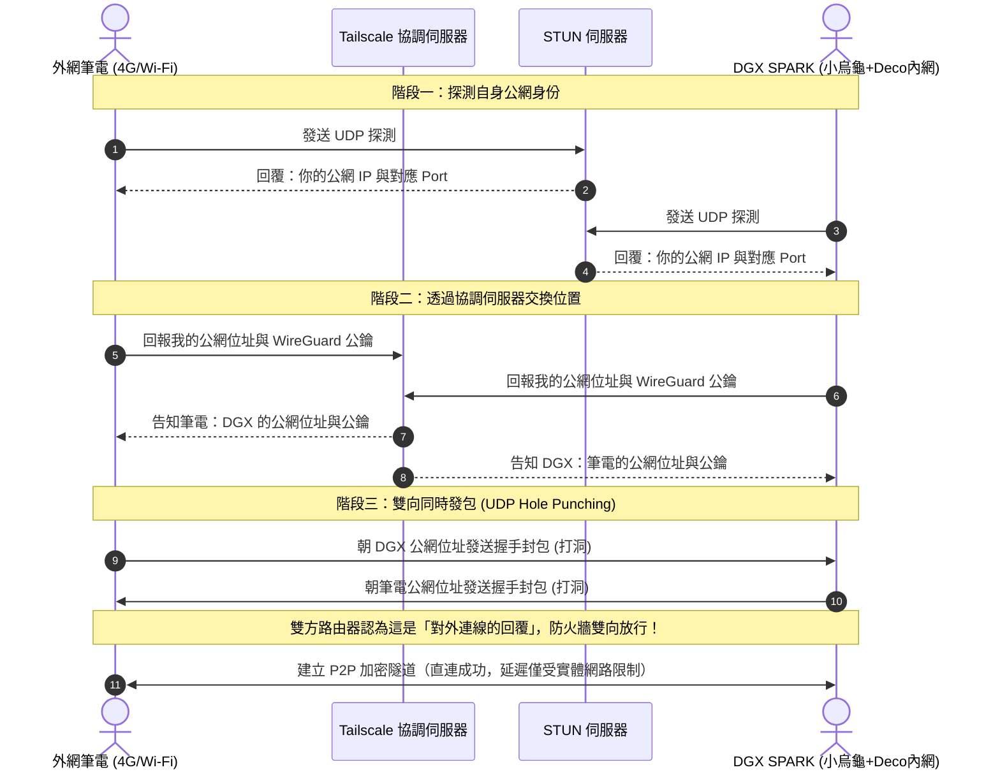

# DGX SPARK 遠端連線配置手冊
*(適用於外部筆電存取 Qwen 3.8 27B、ComfyUI、Terminal Service 3389 等服務)*

---

## 1. 網路拓撲與核心架構

目前家庭/機房的網路結構為標準的雙重 NAT（Double NAT）：
```
中華電信小烏龜 ➔ TP-Link Deco ➔ DGX SPARK
```

### 為什麼不建議傳統「連接埠轉發（Port Forwarding）」？
1. **極高資安風險**：
   * **Terminal Service (Port 3389)** 若直接暴露在公網，幾分鐘內就會遭到全球自動化殭屍網路爆破密碼或勒索病毒漏洞攻擊。
   * **ComfyUI (Port 8188)** 預設**沒有密碼保護機制**，公網任何訪客皆可隨意連入執行任意 Python 工作流。
2. **網路設定繁瑣**：雙重 NAT 需要在小烏龜與 Deco 分別設定兩層轉發，且浮動 IP 需要綁定 DDNS。

---

## 2. 推薦解決方案總覽

為滿足外網筆電連線需求，推薦採用 **Tailscale 點對點虛擬內網** 作為核心通道，並可選搭配 **Cloudflare Tunnel** 作為免客戶端 Web 存取輔助：

| 服務項目 | 推薦連線方式 | 傳輸協定 / 埠號 | 安全機制 |
| :--- | :--- | :--- | :--- |
| **Terminal Service (遠端桌面)** | **Tailscale** 直連 | TCP / 3389 | WireGuard 端到端加密 |
| **ComfyUI** | **Tailscale** / Cloudflare Tunnel | HTTP / 8188 | 內網直連 / Cloudflare Access 驗證 |
| **Qwen 3.8 27B (LM Studio)** | **Tailscale** 直連 | HTTP / 1234 | 內網直連 |

---

## 3. 步驟一：在 DGX SPARK 端安裝 Tailscale

1. **安裝 Tailscale**：
   開啟 DGX 終端機，執行官方一鍵安裝腳本：
   ```bash
   curl -fsSL https://tailscale.com/install.sh | sh
   ```

2. **啟動並登入綁定**：
   ```bash
   sudo tailscale up
   ```
   * 終端機會顯示一組認證 URL（如 `https://login.tailscale.com/a/xxxxxx`）。
   * 在任一瀏覽器打開此網址，以你的 Google 或 GitHub 帳號登入授權。

3. **查詢 DGX 專屬虛擬 IP**：
   ```bash
   tailscale ip -4
   ```
   * 記下輸出結果（格式為 `100.x.y.z`，後續稱為 `DGX_TAILSCALE_IP`）。

---

## 4. 步驟二：在外網筆電端安裝 Tailscale

1. **下載與安裝**：
   前往 [Tailscale 官方網站下載頁面](https://tailscale.com/download)，安裝對應作業系統的客戶端（Windows / macOS）。
2. **登入同一帳號**：
   啟動後登入與 DGX **相同的** Google / GitHub 帳號。
3. **測試連通性**：
   在筆電開啟 PowerShell / 命令提示字元，執行：
   ```powershell
   ping <DGX_TAILSCALE_IP>
   ```
   若能正常收到 Ping 回應，表示雙端已建立點對點加密通道。

---

## 5. 步驟三：DGX 服務監聽設定（關鍵設定）

Linux 服務預設多半只監聽 `127.0.0.1`（本機），必須讓各服務監聽 `0.0.0.0`，Tailscale 虛擬網卡流量才能正確連入。

### 5.1 ComfyUI 監聽設定
啟動 ComfyUI 時加入 `--listen 0.0.0.0` 參數：
```bash
python main.py --listen 0.0.0.0 --port 8188
```

### 5.2 Qwen 3.8 27B 推論服務監聽設定（使用 LM Studio）
LM Studio 內建非常強大的 Local Inference Server（預設 Port 為 `1234`）。
預設情況下，LM Studio 的伺服器只允許本機（`127.0.0.1`）連線，必須開啟**局域網分享**才能讓外網筆電透過 Tailscale 連入：

1. 打開 DGX 上的 **LM Studio**。
2. 點擊左側選單的 **「Local Server」**（圖示為 `<->` 或開發者符號）。
3. 頂部選擇並加載你的 **Qwen 3.8 / 27B** 模型。
4. 在右側或下方的 **Server Configuration (伺服器設定)** 進行關鍵修改：
   * **Listening on** / **Network Interface**：將原本的 `127.0.0.1` 改為 **`0.0.0.0`**（或開啟 **「Serve on Local Network」** 開關）。
   * **Port**：維持預設 `1234`。
   * **CORS**：建議打勾開啟（允許跨域請求，方便各種前端或外網 WebUI 呼叫）。
5. 點擊綠色的 **「Start Server」** 啟動服務。

### 5.3 Terminal Service (XRDP / Port 3389)
* 檢查服務狀態：
  ```bash
  sudo systemctl status xrdp
  ```
* 防火牆（UFW）若有啟用，請放行 Tailscale 介面流量：
  ```bash
  sudo ufw allow in on tailscale0 to any port 3389
  ```

---

## 6. 步驟四：外網筆電連線操作指南

確認筆電已啟動 Tailscale 後，即可像在區網一樣存取各項服務：

### ① 遠端桌面（Terminal Service 3389）
1. 按下鍵盤 `Win + R`，輸入 `mstsc` 開啟「遠端桌面連線」。
2. 電腦名稱欄位輸入：
   ```text
   <DGX_TAILSCALE_IP>:3389
   ```
   *(例如：`100.85.12.34:3389`)*
3. 點選連線，輸入 DGX 系統帳號與密碼即可進入圖形化桌面。

### ② ComfyUI
在筆電瀏覽器（Chrome / Edge）網址列直接輸入：
```text
http://<DGX_TAILSCALE_IP>:8188
```

### ③ 連接 DGX 的 LM Studio (Qwen 27B)
LM Studio 提供完全相容 OpenAI 的 API 端點，外網筆電可以用以下方式使用：

* **連線測試（確認 API 運作中）**：
  在筆電瀏覽器或 PowerShell 測試：
  ```powershell
  curl http://<DGX_TAILSCALE_IP>:1234/v1/models
  ```
  若回傳模型清單 JSON，即表示連線成功！

* **使用聊天用戶端（如 Chatbox、Cherry Studio、NextChat）**：
  * **API 類型**：選擇 `OpenAI API`
  * **API Host / Base URL**：`http://<DGX_TAILSCALE_IP>:1234/v1`
  * **API Key**：輸入 `lm-studio`（或隨意填寫）
  * **Model 名稱**：選擇或填寫加載的 Qwen 模型名稱。

* **在 Python 腳本或程式中呼叫**：
  ```python
  from openai import OpenAI

  client = OpenAI(
      base_url="http://<DGX_TAILSCALE_IP>:1234/v1",
      api_key="lm-studio"
  )

  response = client.chat.completions.create(
      model="qwen",
      messages=[{"role": "user", "content": "你好，請自我介紹！"}]
  )
  print(response.choices[0].message.content)
  ```

---

## 7. 補充：使用 Cloudflare Tunnel 讓 ComfyUI 綁定專屬網域 (免裝客戶端)

若希望在未安裝 Tailscale 的裝置上，透過你的自訂網域（如 `ark945.ccwu.cc`）直接打開 ComfyUI，可使用 Cloudflare Tunnel 搭配驗證防護：

1. **DGX 安裝 cloudflared**：
   ```bash
   curl -L --output cloudflared.deb https://github.com/cloudflare/cloudflared/releases/latest/download/cloudflared-linux-amd64.deb
   sudo dpkg -i cloudflared.deb
   ```
2. **在 Cloudflare Zero Trust 建立 Tunnel**：
   * 前往 Cloudflare Dashboard ➔ **Zero Trust** ➔ **Networks** ➔ **Tunnels**。
   * 新增 Tunnel（例如命名為 `dgx-spark`），依網頁提示將 Connector Token 複製到 DGX 貼上執行。
   * 設定 **Public Hostname**：
     * Subdomain: `comfy`（完整為 `comfy.ark945.ccwu.cc`）
     * Service: `HTTP://localhost:8188`
3. **啟用 Cloudflare Access 驗證（必做保護）**：
   * 在 Zero Trust ➔ **Access** ➔ **Applications** 新增應用程式，綁定 `comfy.ark945.ccwu.cc`。
   * 設定驗證 Policy 為僅允許輸入特定 Email 收取 PIN 碼，防止公網惡意爬蟲或陌生人隨意存取你的 ComfyUI。

---

## 8. 深度解析：Tailscale 核心運行機制與原理

Tailscale 能徹底解決中華電信小烏龜與 Deco 的「雙重 NAT」且「免開任何連接埠」，其背後整合了 **WireGuard 加密**、**控制/資料平面分離** 以及 **NAT 穿透（NAT Traversal）黑科技**。

### 8.1 架構核心：控制平面與資料平面分離

傳統 VPN（如 OpenVPN、IPsec）為中心化星狀結構，所有流量都必須經過單一 VPN 伺服器轉發，常有頻寬瓶頸與隱私疑慮。Tailscale 則完全拆分了這兩層：

```mermaid
graph TD
    subgraph 控制平面 Control Plane
        Coord[Tailscale 協調伺服器\nCoordination Server]
    end

    subgraph 你的私有網路
        Laptop[外網筆電]
        DGX[DGX SPARK]
    end

    Coord -. 1. 交換金鑰與節點位址 .-> Laptop
    Coord -. 1. 交換金鑰與節點位址 .-> DGX
    
    Laptop <=== 2. 端到端 WireGuard 加密直連 (P2P 流量) ===> DGX
```

* **控制平面（Control Plane / 協調伺服器）**：
  * 只負責：身份認證（Google/GitHub SSO）、節點 WireGuard 公鑰交換、分配 `100.x.y.z` 虛擬 IP、下發存取控制策略（ACL）。
  * **❌ 不碰任何真實傳輸資料**：Tailscale 官方完全無法看到、也碰不到你傳輸的畫面、指令或模型參數。
* **資料平面（Data Plane / 節點直連）**：
  * 節點之間透過 WireGuard 協定建立**點對點（P2P）直接加密通道**。外網筆電直連 DGX，延遲最低、頻寬最高。

---

### 8.2 NAT 穿透機制：如何突破小烏龜 + Deco 雙重 NAT？

外部主機平常無法主動連入家中，是因為被小烏龜與 Deco 的防火牆擋下。Tailscale 透過一套名為 **Disco (Discovery Protocol)** 的協定進行「UDP 雙向打洞」：



1. **STUN 探測**：DGX 與筆電各自向外發起 UDP 探測，得知自己在公網眼中的真實「公網 IP:Port」映射。
2. **雙向打洞（UDP Hole Punching）**：
   * 筆電若單向連進 DGX，會被 Deco 防火牆擋下；
   * 但若 **DGX 也同時朝筆電發送 UDP 封包**，Deco 和小烏龜的 NAT 狀態表就會建立「本地發起過外聯」的通行記錄。
   * 此時筆電打過來的封包便會被判定為「合法回包」，防火牆雙向放行，成功建立 P2P 直連！

---

### 8.3 保底機制：DERP 中繼伺服器（永不失聯）

若雙方身處極端嚴苛的網路環境（例如公司企業網路採用了嚴格的 **對稱型 NAT (Symmetric NAT)**，導致 UDP 隨機映射使打洞失敗）：
* **自動無縫切換**：Tailscale 會自動轉由距離雙方最近的 **DERP (Designated Encrypted Relay for Packets)** 伺服器進行中繼轉發。
* **端到端加密不中斷**：即使經過 DERP 轉發，**WireGuard 的端到端加密依然有效**。DERP 伺服器只能看到亂碼封包，完全無法解密資料內容。

---

### 8.4 虛擬位址分配與 MagicDNS

* **CGNAT 保留網段 (`100.64.0.0/10`)**：
  每個加入 Tailscale 網路的裝置都會分配到一個唯一的 `100.x.y.z` 虛擬 IP，絕對不會與家中區域網路的 `192.168.x.x` 或外網 Wi-Fi 的 `10.x.x.x` 產生 IP 衝突。
* **MagicDNS**：
  Tailscale 提供全自動的網域名稱解析。如果將 DGX 命名為 `dgx-spark`，外網筆電甚至不需要記 IP，直接在瀏覽器輸入：
  ```text
  http://dgx-spark:8188          # 直連 ComfyUI
  http://dgx-spark:1234/v1       # 直連 LM Studio
  ```
  系統會自動將該名稱解析為對應的 Tailscale 虛擬 IP。

