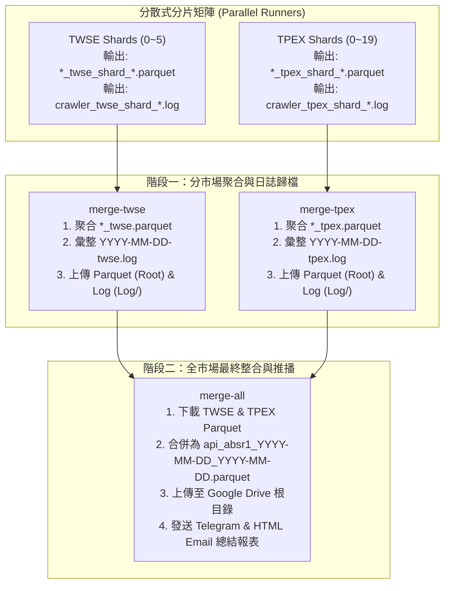

# 雲端執行架構升級設計文件：Parquet 全市場整合與分片日誌彙整

## 1. 需求與背景
1. **全市場 Parquet 合併**：雲端分散式排程除保留既有之上市 `api_absr1_YYYY-MM-DD_YYYY-MM-DD_twse.parquet` 與上櫃 `api_absr1_YYYY-MM-DD_YYYY-MM-DD_tpex.parquet` 獨立檔案外，需自動執行二次聚合，產出全市場統一檔案 `api_absr1_YYYY-MM-DD_YYYY-MM-DD.parquet` 並上傳至 Google Drive 與 GitHub Actions Artifacts。
2. **分片 Log 彙整與雲端歸檔**：將 TWSE（6 個分片）與 TPEX（20 個分片）之所有執行日誌分別彙整為 `YYYY-MM-DD-twse.log` 與 `YYYY-MM-DD-tpex.log`，並自動上傳至 Google Drive 中的 `Log` 資料夾。

---

## 2. 系統架構設計

### 2.1 工作流程圖 (GitHub Actions Pipeline)

---

## 3. Google Drive 資料夾管理
- **Parquet 存放位置**：Google Drive 根資料夾（由 `GDRIVE_FOLDER_ID` 定義）。
  - `api_absr1_YYYY-MM-DD_YYYY-MM-DD_twse.parquet`
  - `api_absr1_YYYY-MM-DD_YYYY-MM-DD_tpex.parquet`
  - `api_absr1_YYYY-MM-DD_YYYY-MM-DD.parquet`
- **Log 存放位置**：Google Drive 根資料夾下的 `Log/` 子資料夾。
  - `YYYY-MM-DD-twse.log`
  - `YYYY-MM-DD-tpex.log`
