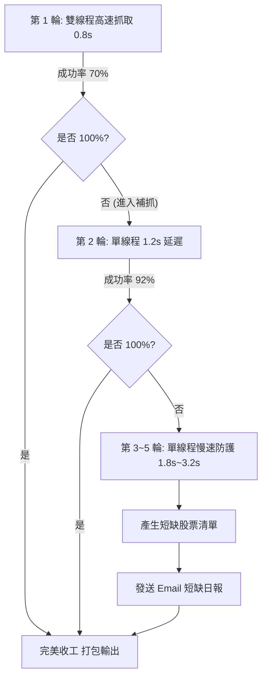

# 🚀 台股券商分點爬蟲雲端排程設置指南

本文件提供將台股分點爬蟲部署至雲端環境（**GitHub Actions 零成本伺服器、Linux VPS 主機、Docker 容器**）的完整設置流程、5 輪階梯式安全補抓、Email 短缺日報與自動化歸檔設定。

---

## 📌 目錄
1. [方案一：GitHub Actions 零成本自動排程 (推薦)](#1-方案一github-actions-零成本自動排程-推薦)
   - [1.1 GitHub Actions 工作流程配置](#11-github-actions-工作流程配置)
   - [1.2 設定 Email 報表通知 (GitHub Secrets)](#12-設定-email-報表通知-github-secrets)
   - [1.3 手動一鍵觸發與下載 Parquet 資料包](#13-手動一鍵觸發與下載-parquet-資料包)
2. [方案二：Linux VPS / NAS 伺服器排程部署](#2-方案二linux-vps--nas-伺服器排程部署)
3. [雲端大數據庫同步 (Hugging Face Datasets / Google Drive)](#3-雲端大數據庫同步)
4. [5 輪自適應安全防 Ban 機制解析](#4-5-輪自適應安全防-ban-機制解析)

---

## 🚀 1. 方案一：GitHub Actions 零成本自動排程 (推薦)

GitHub Actions 提供每週一至週五盤後定時觸發，執行 5 輪自適應補抓，產出高度壓縮之 Parquet 檔案並寄送詳細短缺股票 Email 日報，完全無需自備伺服器。

### 1.1 GitHub Actions 工作流程配置
檔案路徑：`.github/workflows/daily_stock_crawler.yml`

```yaml
name: 每日全市場券商分點爬蟲排程

on:
  schedule:
    # 每週一至週五 台灣時間 20:30 (UTC 12:30)
    - cron: '30 12 * * 1-5'
  workflow_dispatch: # 支援在 GitHub 網頁手動一鍵觸發
    inputs:
      target_date:
        description: '指定抓取日期 (YYYY-MM-DD，留空則自動判斷最新交易日)'
        required: false
        default: ''
      market:
        description: '抓取市場 (all / twse / tpex)'
        required: true
        default: 'all'

jobs:
  run-crawler:
    runs-on: ubuntu-latest
    timeout-minutes: 60

    steps:
      - name: 檢出專案代碼 (Checkout)
        uses: actions/checkout@v4

      - name: 設定 Python 環境
        uses: actions/setup-python@v5
        with:
          python-version: '3.12'
          cache: 'pip'

      - name: 安裝系統依賴 (Chromium for TPEX)
        run: |
          sudo apt-get update
          sudo apt-get install -y chromium-browser xvfb

      - name: 安裝 Python 套件依賴
        run: |
          pip install --upgrade pip
          if [ -f requirements.txt ]; then
            pip install -r requirements.txt
          elif [ -f stock_data_downloader/requirements.txt ]; then
            pip install -r stock_data_downloader/requirements.txt
          fi
          pip install tensorflow

      - name: 執行全市場分點爬蟲 (5 輪安全補抓 + Email 短缺日報)
        env:
          PYTHONIOENCODING: "utf-8"
          SMTP_SERVER: ${{ secrets.SMTP_SERVER }}
          SMTP_PORT: ${{ secrets.SMTP_PORT }}
          SMTP_USER: ${{ secrets.SMTP_USER }}
          SMTP_PASSWORD: ${{ secrets.SMTP_PASSWORD }}
          RECEIVER_EMAIL: ${{ secrets.RECEIVER_EMAIL }}
        run: |
          TARGET_DATE="${{ github.event.inputs.target_date }}"
          MARKET="${{ github.event.inputs.market }}"
          
          if [ -z "$MARKET" ]; then
            MARKET="all"
          fi
          
          if [ -f "stock_crawler_coordinator.py" ]; then
            TARGET_SCRIPT="stock_crawler_coordinator.py"
          elif [ -f "stock_data_downloader/stock_crawler_coordinator.py" ]; then
            TARGET_SCRIPT="stock_data_downloader/stock_crawler_coordinator.py"
          else
            TARGET_SCRIPT="dataProject/stock_crawler_coordinator.py"
          fi
          
          if [ -n "$TARGET_DATE" ]; then
            python "$TARGET_SCRIPT" --market "$MARKET" --date "$TARGET_DATE" --workers 8 --max-rounds 5 --no-excel
          else
            python "$TARGET_SCRIPT" --market "$MARKET" --workers 8 --max-rounds 5 --no-excel
          fi

      - name: 上傳成果為 GitHub Artifact (僅 Parquet，保留 7 天)
        uses: actions/upload-artifact@v4
        if: always()
        with:
          name: stock-bsr-parquet-${{ github.run_number }}
          path: |
            output/*.parquet
            stock_data_downloader/output/*.parquet
            dataProject/output/*.parquet
          retention-days: 7
```

---

### 1.2 設定即時推播通知 (Telegram / Email Secrets)

爬蟲結束後若欲在手機收到 **Telegram 即時推播日報與短缺股票明細**，請在 GitHub 倉庫設定 Secrets：

1. 前往 GitHub 專案頁面 ➡️ **Settings** ➡️ **Secrets and variables** ➡️ **Actions**。
2. 點擊 **New repository secret**，新增以下變數：

| Secret 名稱 | 內容說明 | 您的數值範例 |
| :--- | :--- | :--- |
| **`TELEGRAM_BOT_TOKEN`** | Telegram 機器人 Token (由 @BotFather 提供) | `1234567890:ABCdefGhIJKlmNoPQRsTUVwxyZ` |
| **`TELEGRAM_CHAT_ID`** | 您的 Telegram 使用者 ID (由 @userinfobot 提供) | `1234567890` |

*(選填) 若亦需 Email 備援通知：*
* `SMTP_USER`：寄件 Gmail（例如 `yourname@gmail.com`）
* `SMTP_PASSWORD`：Google 16 位應用程式密碼
* `RECEIVER_EMAIL`：收件信箱（例如 `ark@tdcc.com.tw`）

---

### 1.3 手動一鍵觸發與下載 Parquet 資料包

1. **手動執行**：進入 GitHub 專案 ➡️ 點選 **Actions** ➡️ 點擊左側 **「每日全市場券商分點爬蟲排程」** ➡️ 點擊右側 **Run workflow**。
2. **下載資料**：執行完畢後，在該次 Workflow 紀錄最下方的 **Artifacts** 區塊點擊 `stock-bsr-parquet-N.zip` 即可取得全市場資料（每天約 5~12 MB）。

---

### 1.4 每日晨間通知測試與心跳檢測 (每天 06:30)

專案內建獨立的測試工作流程檔案 `.github/workflows/test_notification.yml`：
* ⏰ **自動排程時間**：每天早上 **台灣時間 06:30** (`cron: '30 22 * * *'`) 自動執行，發送一則心跳測試至 Telegram 與 Email，確認通訊管道暢通。
* 🖱️ **手動一鍵驗證**：隨時可在 GitHub 專案 **Actions** 點選 **「通知推播連線測試 (Telegram & Email)」** ➡️ 點擊 **Run workflow** 進行即時連線驗證！

---

## 🖥️ 2. 方案二：Linux VPS / NAS 伺服器排程部署

適用於 GCP、AWS EC2、自建 Ubuntu 伺服器或 Synology NAS。

### (1) 環境初始化與安裝
```bash
sudo apt update && sudo apt install -y python3 python3-pip python3-venv git chromium-browser xvfb
git clone https://github.com/ark945/stock_data_downloader.git /opt/stock_crawler
cd /opt/stock_crawler
python3 -m venv venv
source venv/bin/activate
pip install -r requirements.txt
pip install tensorflow
```

### (2) 設定 Crontab 定時排程
輸入 `crontab -e` 並新增：
```bash
# 每週一至週五 晚上 20:30 (台灣時間) 自動執行 5 輪補抓並寄送 Email
30 20 * * 1-5 cd /opt/stock_crawler && SMTP_USER="your@gmail.com" SMTP_PASSWORD="app-password" RECEIVER_EMAIL="ark@tdcc.com.tw" /opt/stock_crawler/venv/bin/python stock_crawler_coordinator.py --market all --max-rounds 5 --no-excel >> /var/log/stock_crawler.log 2>&1
```

---

## ☁️ 3. 雲端大數據庫同步 (Hugging Face / Google Drive)

若欲永久保存數年份（數十 GB）的全歷史分點資料庫，推薦自動同步至 **Hugging Face Datasets**（完全免費、容量無上限、原生支援 DuckDB 雲端穿透）：

```python
from huggingface_hub import HfApi

api = HfApi(token="YOUR_HF_TOKEN")
api.upload_folder(
    folder_path="output",
    repo_id="ark945/tw-stock-bsr-dataset",
    repo_type="dataset"
)
```

---

## 🛡️ 4. 5 輪自適應安全防 Ban 機制解析

系統內建自適應降速與智慧冷卻閉環，徹底消除 IP 封鎖與無限死迴圈風險：



1. **輪次自適應延遲**：第 1 輪 (0.8s) ➡️ 第 2 輪 (1.2s) ➡️ 第 3 輪 (1.8s) ➡️ 第 4 輪 (2.5s) ➡️ 第 5 輪 (3.2s)。
2. **單線程安全模式**：補抓階段全面切換為單 Worker 慢速請求，完全符合正常用戶瀏覽行為。
3. **無交易標的識別**：過濾當日減資、暫停交易或無成交紀錄之標的，避免無效重試。
4. **短缺即時通報**：若達第 5 輪仍有少數標的未成功，將股票代碼與名稱自動彙整寄送 Email。
