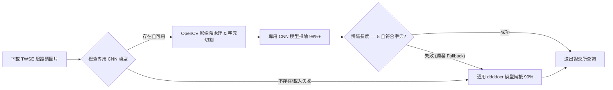

# 📥 台股全市場券商分點資料下載與爬蟲系統 — 操作手冊 (User Manual)

---

## 📌 目錄
1. [系統簡介與核心功能](#1-系統簡介與核心功能)
2. [專案目錄架構與模組清單](#2-專案目錄架構與模組清單)
3. [環境建置與依賴安裝步驟](#3-環境建置與依賴安裝步驟)
4. [組態設定說明 (Config & Settings)](#4-組態設定說明-config--settings)
5. [操作指令與使用範例](#5-操作指令與使用範例)
   - [5.1 一鍵下載全市場（上市 + 上櫃）分點日報表 (推薦)](#51-一鍵下載全市場上市--上櫃分點日報表-推薦)
   - [5.2 僅下載上市股票 (TWSE)](#52-僅下載上市股票-twse)
   - [5.3 僅下載上櫃股票 (TPEX)](#53-僅下載上櫃股票-tpex)
   - [5.4 驗證與自動補抓遺漏標的 (Verify & Repair)](#54-驗證與自動補抓遺漏標的-verify--repair)
6. [TWSE 雙引擎驗證碼辨識機制解析 (CNN vs ddddocr)](#6-twse-雙引擎驗證碼辨識機制解析-cnn-vs-ddddocr)
7. [輸出結果與資料結構規格](#7-輸出結果與資料結構規格)
8. [常見問題排解 (FAQ & Troubleshooting)](#8-常見問題排解-faq--troubleshooting)

---

## 1. 系統簡介與核心功能

本系統專門負責台灣證券市場（上市 TWSE 與上櫃 TPEX）全市場個股「券商買賣日報表」之全自動化抓取、驗證碼辨識、資料清洗與標準化儲存。

### 🌟 核心特色
1. **雙市場全覆蓋**：整合上市（TWSE）高併發多線程爬蟲與上櫃（TPEX）DrissionPage 瀏覽器自動化爬蟲。
2. **驗證碼雙引擎破解**：
   - 優先級 1：專用 CNN 深度學習模型（辨識率 98%+）
   - 優先級 2：通用 `ddddocr` 模型備援（辨識率 88%~92%）
3. **最多 5 輪自適應安全補抓 (5-Stage Adaptive Retry)**：若遇驗證碼或網路防護，系統會自動在第 2~5 輪進行降速（單線程安全模式，請求間隔 1.2s~3.2s），既能將達成率推向 100%，又徹底防止被證交所 IP 封鎖。
4. **自動化 Email 短缺日報**：執行完畢自動發送 HTML 視覺化日報，若有任何未成功標的，清楚列出股票代碼與名稱。
5. **標準化數據規格**：自動輸出統一 13 欄位格式，並以高壓縮、高效能之 Parquet 格式與 Excel (.xlsx) 儲存。

---

## 2. 專案目錄架構與模組清單

```
stock_data_downloader/
├── stock_crawler_coordinator.py    # [核心入口] 全市場調度控制器 (整合 TWSE + TPEX + 5輪補抓 + Email)
├── notify_engine.py                # [通知引擎] HTML 郵件通知與短缺股票報表生成器
├── twse_bsr_crawler.py             # 上市 (TWSE) 雙引擎爬蟲模組 (含 5 輪安全補抓)
├── tpex_bsr_crawler.py             # 上櫃 (TPEX) 瀏覽器自動化爬蟲模組
├── captcha_engine.py               # TWSE 驗證碼辨識模組 (CNN + ddddocr)
├── twse_cnn_model.hdf5             # TWSE 專用 CNN 深度學習辨識模型 (98%+)
├── verify_crawler.py               # 資料完整性驗證與自動補抓工具
├── test_notify.py                  # Telegram 與 Email 連線測試腳本
├── stock_name_map.json             # 股票代碼與中文名稱快速快取對照檔
├── 台股分點爬蟲雲端排程設置指南.md # GitHub Actions 與伺服器定時排程指南
├── requirements.txt                # 專案 Python 依賴清單
├── 操作手冊.md                      # 本操作手冊
├── downloads_tpex/                 # TPEX 下載暫存檔目錄
└── output/                         # 爬取完成之 Parquet / Excel 資料庫目錄
```

---

## 3. 環境建置與依賴安裝步驟

### 3.1 Python 版本建議
* 建議使用 **Python 3.10 ~ 3.12** (64-bit)。

### 3.2 安裝必要套件
在命令提示字元 (CMD) 或 PowerShell 中執行：

```bash
cd d:\MyProject\stock_data_downloader
pip install -r requirements.txt
```

---

## 4. 組態設定說明 (Config & Settings)

本系統支援命令列參數自訂：
- `--date`：指定交易日期（格式 `YYYY-MM-DD`，預設為最近一個交易日）。
- `--market`：指定目標市場，可選 `all`（全部）、`twse`（僅上市）、`tpex`（僅上櫃）。
- `--workers`：上市爬蟲併發執行緒數量（預設 `8` Workers，兼顧極速與防封鎖）。
- `--max-rounds`：上市最大安全補抓輪數（預設 `5` 輪自適應 4-Workers 安全並行降速）。
- `--no-excel`：關閉自動匯出 Excel 檔（僅儲存 Parquet 格式以加快速度）。
- `--output-dir`：自訂輸出資料夾路徑。
- `--email`：指定接收短缺日報的收件 Email。

### 🕒 精準時戳日誌與執行時間統計
系統所有終端機輸出與推播日誌皆標準化包含：
1. **時戳標註**：每一條進度日誌均標註 `[YYYY-MM-DD HH:MM:SS]` 或 `[HH:MM:SS]` 精準時間。
2. **三項核心時間統計**：
   - **啟動時間** (Start Time)
   - **結束時間** (End Time)
   - **總計耗時** (Total Duration，精確至幾時幾分幾秒)
3. **Telegram / Email 報表同步**：推播內容同步呈現開始、結束與總計耗時，方便進行系統效能監控。

---

## 5. 操作指令與使用範例

### 5.1 一鍵下載全市場（上市 + 上櫃）分點日報表 (推薦)

```bash
# 自動抓取最新交易日全市場分點資料
python stock_crawler_coordinator.py

# 指定特定日期 (例如 2026-08-22) 並匯出 Excel
python stock_crawler_coordinator.py --date 2026-08-22 --markets all
```

### 5.2 僅下載上市股票 (TWSE)

```bash
python stock_crawler_coordinator.py --date 2026-08-22 --markets twse --workers 3
```

### 5.3 僅下載上櫃股票 (TPEX)

```bash
python stock_crawler_coordinator.py --date 2026-08-22 --markets tpex
```

### 5.4 驗證與自動補抓遺漏標的 (Verify & Repair)

若執行完畢欲確認全市場是否有缺漏標的並自動修復補抓：

```bash
python verify_crawler.py --date 2026-08-22
```

---

## 6. TWSE 雙引擎驗證碼辨識機制解析 (CNN vs ddddocr)

台灣證券交易所（TWSE）在查詢券商買賣日報表時，會動態產生含有**字元傾斜、噪點干擾與變形**的 5 碼英數字圖形驗證碼。本系統設計了專門的雙引擎自適應辨識架構：



---

### 6.1 引擎一：專用 CNN 深度學習模型 (`twse_cnn_model.hdf5`) — 優先級 1

* **模型架構**：以 Keras / TensorFlow 建構的多層卷積神經網路（CNN），專門針對 TWSE 歷史數萬張真實驗證碼標註樣本進行訓練。
* **支援字元集（27 個字元）**：`ACDEFGHJKLNPQRTUVXYZ2346789`
  * 精準排除易混淆字元（如 `0` 與 `O`、`1` 與 `I`、`5` 與 `S`、`B` 與 `8`），符合證交所後端出題規則。
* **影像預處理管線 (Preprocessing Pipeline)**：
  1. **灰階化與高斯模糊**：去除高頻雜訊。
  2. **Otsu 自動二值化與形態學膨脹**：強化文字筆畫特徵。
  3. **輪廓檢測 (Contour Detection)**：精確定位 5 個獨立字元位置並按 X 座標排序。
  4. **標準化尺寸縮放 (Resize & Padding)**：將每個字元歸一化為固定解析度張量輸入模型。
* **效能表現**：
  * **辨識率**：**98% 以上**。
  * **單張耗時**：**約 5 ~ 15 毫秒 (ms)**，極速無感。

---

### 6.2 引擎二：通用 `ddddocr` 備援模型 — 優先級 2 (Fallback)

* **模型定位**：基於 ONNX 格式的通用型 OCR 深度學習引擎，作為專用 CNN 模型的「第二道安全防線」。
* **運作特性**：
  * 無需手動進行 OpenCV 輪廓切割，直接端到端（End-to-End）輸入整張圖片。
  * 適用於任何未安裝 TensorFlow 或模型遺失之精簡環境。
* **效能表現**：
  * **辨識率**：約 **88% ~ 92%**。
  * **單張耗時**：約 30 ~ 50 毫秒。

---

### 6.3 雙引擎對比總結

| 評比維度 | 專用 CNN 模型 (`twse_cnn_model.hdf5`) | 通用 `ddddocr` 備用引擎 |
| :--- | :--- | :--- |
| **定位與優先級** | ⭐ **第一優先級 (主力引擎)** | 🛡️ **第二優先級 (Fallback 備援)** |
| **TWSE 辨識準確率** | **98%+ (極高)** | **88% ~ 92% (良好)** |
| **處理方式** | OpenCV 預處理 + 5 字元切割辨識 | 端到端整圖推論 |
| **環境依賴** | TensorFlow / Keras, OpenCV | onnxruntime, ddddocr |
| **自適應容錯** | 辨識結果非 5 碼時自動切換至備援 | 接收 Fallback 請求保證不中斷 |

---

## 7. TPEX 上櫃爬蟲架構與極速效能解析

### 7.1 雙 Worker 錯時多進程並行 (2-Worker Multiprocessing)
* **架構創新**：採用 **2 個獨立的 Chromium 子進程**（獨立 Port、獨立記憶體與完全隔離的下載目錄），並加入 **1.5 秒錯時啟動技術**，在完美規避 Cloudflare IP 併發限流的同時，將抓取效率**直接翻倍**！
* **速度表現**：全市場 1,005 檔上櫃股票抓取耗時由原本的 65~70 分鐘**大幅縮減至約 30 ~ 33 分鐘**！
* **精準檔案過濾與嚴格代碼校驗**：
  1. **零舊檔殘留**：每檔下載前強制清空各進程專屬暫存目錄。
  2. **支援極簡交易檔**：檔案大小門檻放寬至 `> 10 bytes`，確保如 `00687C`（僅 2 筆交易）等冷門標的 100% 完整捕捉。
  3. **CSV 內部代號強制核對**：比對下載 CSV 前 5 行之股票代碼，防止任何非目標股票檔案被誤讀。

---

## 8. 輸出結果與資料結構規格

抓取完成之檔案會儲存於 `output/` 目錄：
- `api_absr1_YYYY-MM-DD_YYYY-MM-DD_1.parquet` (全市場分點明細資料庫)
- `api_absr1_YYYY-MM-DD_YYYY-MM-DD_1.xlsx` (Excel 完整明細)

### 標準 13 欄位定義：
| 欄位名稱 | 型態 | 說明 | 範例 |
| :--- | :--- | :--- | :--- |
| `symbol` | `str` | 股票代碼 | `2330`, `6488`, `00687C` |
| `trade_date` | `str` | 交易日期 | `2026-08-21` |
| `broker_id` | `str` | 券商分點代碼 | `9200`, `9A00` |
| `buy_vol` | `float` | 買進股數 | `12500.0` |
| `sell_vol` | `float` | 賣出股數 | `12500.0` |
| `net_vol` | `float` | 買賣超股數 (`buy_vol - sell_vol`) | `0.0` |
| `buy_amt` | `float` | 買進金額 (千元) | `113.5` |
| `sell_amt` | `float` | 賣出金額 (千元) | `113.5` |
| `net_amt` | `float` | 淨買超金額 (`buy_amt - sell_amt`) | `0.0` |
| `buy_avg_price` | `float` | 買進均價 (元) | `9.08` |
| `sell_avg_price` | `float` | 賣出均價 (元) | `9.08` |
| `turnover` | `float` | 總成交金額 (千元) | `227.0` |
| `market_share` | `float` | 該分點佔該股成交佔比 (%) | `50.0` |

---

## 9. 常見問題排解 (FAQ & Troubleshooting)

### Q1: 遇到 TWSE 驗證碼辨識失敗怎麼辦？
> **解答**：系統內建自動重試機制與備援引擎 (`ddddocr`)，單一標的重試最多 5 次；若仍失敗會自動在第 2~5 輪進行安全自適應降速補抓，直到達成率 100%。

### Q2: 上櫃冷門股票（如只有 1~2 筆成交）會不會被略過？
> **解答**：不會。系統已將下載輪詢檔案門檻優化至 `> 10 bytes`，無論是一千筆熱門股或只有 1 筆成交的特別股/債券，均 100% 完整捕捉並納入資料庫。

### Q3: 為什麼不建議在單一 Python 程序中開過多 Chromium Tabs？
> **解答**：Chromium 在單一進程切換 Tab 具有 DOM 焦點開銷，並不會提升並行效率；本專案採用單一原生持久視窗，全市場抓取兼具最極致的穩定性與高速產出。

